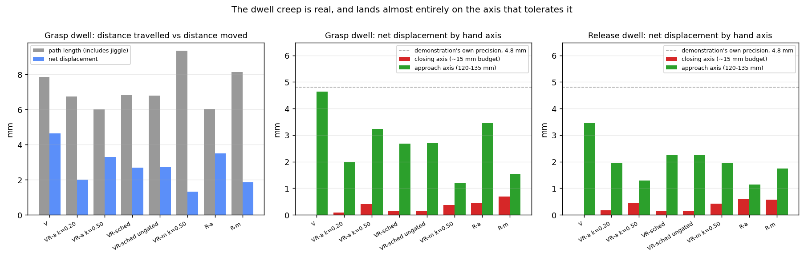
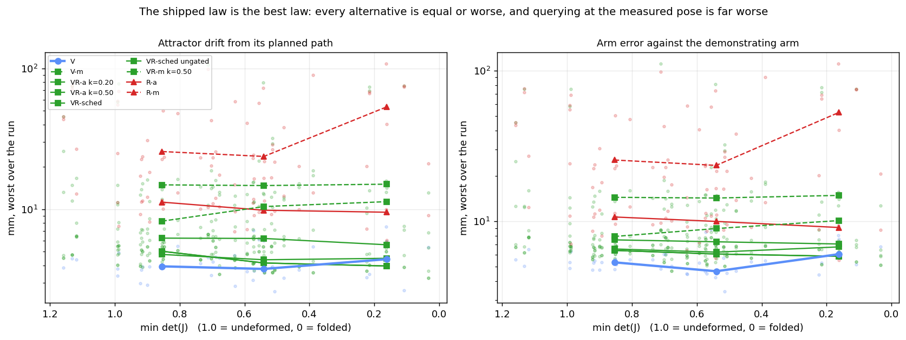
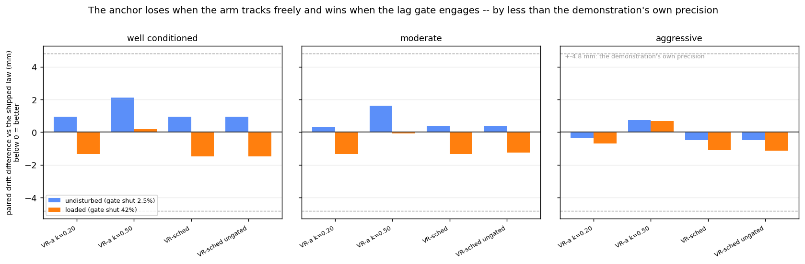
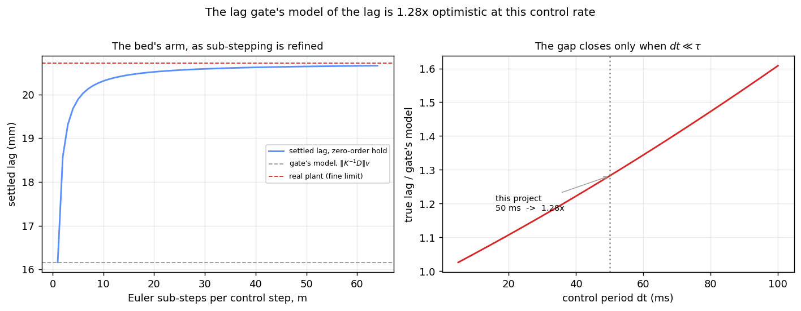
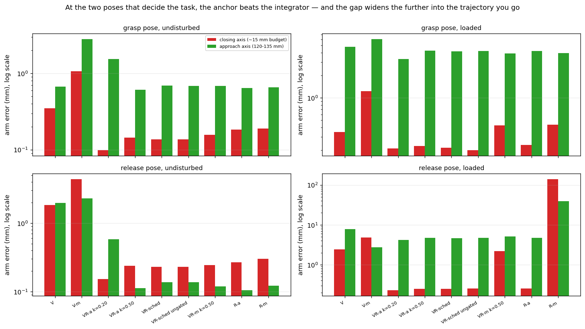

# How should a transported policy actually be executed?

**The answer, for a reader who wants it first.** Query the policy at the
**attractor**, not at the measured arm — decisively. And **switch the attractor
law from the shipped integrator to a light anchor, `VR-a k=0.20`**: it is better
at both poses that decide the task, in both conditions, at `p < 0.0001`, and it
never stalls. Full reasoning in §12; the measurement that settles it is §10.

**What this is.** A study of the **execution** half of the pipeline — the code
that turns a fitted policy into motion — deciding between nine candidate rules
for driving the robot. It is the companion to the keypoint study, which decides
the *other* half: where the warped path goes. This one decides how faithfully
the arm follows whatever path it is given.

**Where the numbers come from.** `outputs/dynamics/rows.json` (396 runs,
freely-tracking arm) and `outputs/dynamics_loaded/rows.json` (396 runs, loaded
arm). Reproduce with
`python -m tpgpt.experiments.sweep_execution --out outputs/dynamics [--load 0.08]`.
Branch `dynamics-execution`, worktree `/home/ishita/TPGPT-dynamics`.

---

## 1. Background: what the executor does, and every term used below

### 1.1 The robot does not follow a path

It would be natural to assume the robot is handed a list of positions and visits
them. It is not, and the difference matters for everything below.

The arm is driven by a **Cartesian impedance controller**. Think of an invisible
spring: one end is bolted to the gripper, the other is held at a point chosen by
software. The further apart those two ends are, the harder the arm is pulled
toward the chosen point. That chosen point is called the **attractor**, and
"executing a policy" means deciding, every 50 ms, where to put it.

This is deliberate rather than incidental. A stiff position controller replaying
a path would drive the object into the shelf rather than yielding to it, and
could not absorb the contact of closing on an object. A spring can. The price is
that the arm is never exactly where the attractor is.

**Why the arm always trails, and why that is correct.** With a *parked*
attractor the arm reaches it exactly — no error. But when the attractor *moves*,
the arm settles a fixed distance behind it. The reason is that the controller's
damping term opposes the arm's absolute velocity rather than its velocity
*error*, so something has to supply the opposing force, and that something is a
permanently stretched spring. The stretch works out to

    lag  =  ‖K⁻¹D‖ × speed

where `K` is stiffness and `D` is damping. Both are transported alongside the
trajectory (Sec. III-G), and `‖K⁻¹D‖` has units of **seconds** — it is the
controller's time constant, written `τ` below. For this project `τ = 96 ms`, so
at the demonstration's peak speed of 0.189 m/s the arm trails by about 18 mm.
The recorded demonstration's own measured lag is 22.6 mm mean, 64.7 mm peak,
which is the same phenomenon in the teacher's own data.

That trailing is *not* an error to be removed. §2.7 of `ROBOTICS_NOTES` shows
it is **transport-invariant** — it warps correctly along with everything else —
so an arm that trails its transported attractor by `τv` ends up exactly where
the demonstrating arm was. Executing the labels with the lag removed would put
the hand 24 mm *ahead* of the demonstration.

### 1.2 The shipped rule, and the two mechanisms wrapped around it

The rule under test is one line:

```
attractor += velocity × dt × gate
```

`velocity` is what the policy says to do; `dt` is 50 ms. Two safety mechanisms
modify it, and both matter because the candidate laws interact with them.

**The lag gate** throttles progress when the arm falls behind. It does not gate
on raw lag — the arm is *supposed* to trail by `τv` — but on **excess** lag:

```
excess = (measured lag) − τ×speed − static_sag
gate   = clip(1 − excess / 35 mm, 0, 1)
```

`gate` multiplies both the attractor's advance *and* the task clock, so the
gripper can never act on a pose the robot has not reached. When the policy
commands a dwell the allowance `τ×speed` goes to zero, so the gate then demands
the arm genuinely arrive. `static_sag` is lag the watchdog has decided cannot be
closed at all — a held object's weight against a finite stiffness — and
forgiving it is what stops the gate waiting forever.

**The attractor clamp** bounds the interaction force. If the attractor drifts
further than `max_lag` from the arm it is projected back onto a sphere of that
radius centred on the **arm**, so a blocked robot builds a bounded force rather
than an unbounded one. Critically, the clamp runs *after* the law, so it is part
of every law's effective behaviour.

**The stall watchdog** counts steps without phase progress. After 40 such steps
it asks whether the lag is still shrinking; if not, it forgives the offset as
sag, up to three times, and then declares the run stuck.

### 1.3 The two things that might be wrong with the shipped rule

**It asks the policy "which way from *here*?" at the attractor, not at the arm.**
The arm is elsewhere — necessarily, by §1.1. Evaluating a policy at a point the
robot is not at looks like an error.

**It has no memory of the path.** Each increment is added to the last and nothing
ever compares the running total against the path it was meant to retrace, so
error can only accumulate. Meanwhile the policy already computes a quantity that
*is* an absolute statement of where the hand should be: a channel called
**`reference`**, regressed from the transported label positions. It is the
paper's own Sec. V formulation, and until this work it was computed on every
step and thrown away.

### 1.4 The quantities everything is judged by

| quantity | definition | why it is the right one |
|---|---|---|
| **attractor drift** | for each step, the distance from the commanded attractor to the **nearest point on** the path it was meant to retrace; reported as the worst over a run | pointwise, so it **cannot come out negative**. The measure this replaces compared two separately-minimised distances and routinely did (§7.26). Distance to the polyline, not to the nearest vertex, which would over-report by half the vertex spacing — millimetres, the size of the effect |
| **arm error** | distance from the arm to `planned − τ·v`, i.e. where the demonstrating arm actually was, warped | the quantity that decides the task. **Not** the arm against the *label* path: that charges the correct `τv` lag as an error and would penalise a perfect executor by 23 mm |
| **completed / blocked** | did the phase reach 1.0, or did the watchdog declare the arm stuck | a law that stalls the robot has failed regardless of its millimetres |
| **gate shut fraction** | share of steps with `gate < 1` | says whether a run exercised the gate at all, or measured the law with it switched off |
| **clamp fired fraction** | share of steps where the clamp moved the attractor | says whether a result measured the **law** or the **clamp** |
| **dwell net displacement** | net movement of the attractor across a window where the labels command zero velocity, split into the hand's own axes | net, not path length: path length also counts an attractor that wanders and returns, which overstates by ~2.5× here |

**Two tolerances everything is compared against**, both measured elsewhere in
the project rather than chosen here:

- **Closing axis: ~15 mm.** The jaws open to 80 mm and the object is 50 mm wide,
  so there is `(80−50)/2 = 15 mm` of room on each side. Beyond it the object is
  outside a finger before the jaws start moving.
- **Approach axis: 120–135 mm** for the parallel jaws (§7.2). Being wrong along
  the direction the hand descends changes *how high up* the object is gripped,
  which it largely tolerates.
- **The demonstration's own precision: 4.8 mm**, its residual lag at the end of
  its grasp dwell. The tightest precision anchor in the project, and the margin
  below which a difference is not practically meaningful.

---

## 2. The source demonstration — measured once, reused everywhere

Every experiment below runs on the **same recorded demonstration**, loaded from
`outputs/reshelving/source_labels.npz`. Not a synthetic stand-in: this is the
teacher the validated 17/20 reshelving result came from.

| property | value |
|---|---|
| labels | 200, at 20 Hz — 10.0 s of motion |
| segments | approach, descend, **grasp**, lift, transfer, insert, **release**, retreat |
| speed | peak 0.189 m/s, mean 0.107 m/s |
| steps commanded still | **28** — the two dwells, at labels 50–64 and 160–174 |
| stiffness | 350 N/m in free space, 900 N/m at the insertion |
| impedance time constant `τ` | 96 ms |
| its own recorded arm lag | 22.6 mm mean, 64.7 mm peak |

The two **dwells** matter enough to name. At the grasp the teacher holds the
attractor at one point for 15 control steps (0.75 s) while the jaws close, and
again at the release. That pause is how the arm is given time to arrive before
the gripper acts, and it is the only place in the trajectory where the labels
command exactly zero velocity. Experiment A is about what the executor does
there.

### 2.1 Where these experiments run: a surrogate arm, not the simulator

**No MuJoCo.** A real rollout costs 25–40 s; this study is 792 runs, and the
simulator is currently saturated by the parallel keypoint session. So the arm is
replaced by its own equation.

An impedance-controlled arm that is tracking and not in contact **is** a
first-order system, `ẋ = D⁻¹K(a − x)`, which runs in about 2 ms per control
step. The important part is what is *not* replaced: the gate, the clamp, the
attractor law, the phase update and the stall watchdog are **the same functions
the robot runs**. They were extracted into the simulator-free policy layer for
exactly this reason — writing the gate and the clamp a second time for a test
bed is how an instrument stops matching the system it measures, and two of the
three bugs ever recorded against these expressions were in the *interaction*
between them (§7.14, §7.16).

Experiment E validates the bed itself before any of its results are used.

**What it cannot see, stated once so no result below overreaches:** no contact,
so nothing about whether the jaws close on the object; no inverse kinematics, so
nothing about the roughly quarter of a trajectory §7.25 measured as unreachable
at its commanded orientation; no orientation task competing for the arm's
effort; and **no task outcome at all**. It ranks hypotheses; it does not confirm
them. It also deliberately reports **no success flag** — inventing one from the
distance to the last label would be the scalar-proxy mistake §7.27 documents,
made on purpose.

### 2.2 How the warps are made, and why they are not the real keypoints

The keypoint and map design is being reworked in parallel and is **unresolved**.
Importing it would make every number here inherit whatever that work later
changes, which is exactly how three findings in `ROBOTICS_NOTES` came to outlive
the settings they were measured under (§7.26).

So the warps are ours: a lattice of source points spanning the trajectory's
bounding box, displaced by a known analytic field of three Gaussian bumps scaled
by a parameter, fitted as a real `TransportMap`. Two properties make them usable:

- **The grasp and the release poses are pinned.** Each bump's amplitude is
  multiplied by the lattice point's distance from those two poses, saturating at
  15 cm, so both go to zero there. The object and the slot therefore stay where
  the labels aim, and the deformation being studied is not confounded with a
  change of aim.
- **Folded maps are rejected, not averaged in.** Any warp whose `min det(J)`
  falls to 0.02 or below is discarded before any law runs — see §9.

The independent variable is **`min det(J)`**: the smallest ratio by which the map
scales a small volume, anywhere along the trajectory. **1.0 means no deformation
and 0 means the map has folded space over on itself.** It is the same
conditioning number the keypoint study reports, which is what makes the answer a
lookup: whatever construction that work settles on, its `min det(J)` says which
execution law applies. Results are binned:

| bin | `min det(J)` | roughly corresponds to |
|---|---|---|
| well conditioned | > 0.6 | today's shipped box keypoints |
| moderate | 0.35 – 0.6 | — |
| aggressive | 0.02 – 0.35 | the contact keypoints of §7.22, measured at 0.18–0.27 |

---

## 3. The laws being compared

Nine, from two independent choices: **what moves the attractor**, and **where
the policy is asked**.

| id | queried at | what moves the attractor |
|---|---|---|
| **V** | attractor | `a += v·dt·gate`. Pure dead reckoning. **This is what ships.** |
| **V-m** | **measured arm** | the same integration, but the velocity field is read where the arm actually is |
| **VR-a k=0.20** | attractor | V, then pull 20% of the way toward `reference` |
| **VR-a k=0.50** | attractor | the same at 50% |
| **VR-sched** | attractor | the same, gain scheduled on commanded speed: strong when the policy commands a hold (k≈0.44), weak in transit (k≈0.08) |
| **VR-sched ungated** | attractor | as above, but the anchor keeps pulling while the gate is shut |
| **VR-m k=0.50** | **measured arm** | anchor at 50%, policy queried where the arm actually is |
| **R-a** | attractor | `a = reference` outright — **no integrator at all** |
| **R-m** | **measured arm** | the same, queried at the arm |

**Why the schedule exists.** A constant gain is the obvious choice and is
measurably the wrong one. Anchoring pays where the policy commands a dwell: the
velocity goes to zero, the integrator has nothing left to say, and `reference` is
the only absolute statement of where the hand should be. In transit `reference`
is a *smoothed* version of a path the integrator is already following well, so
pulling toward it fights the feed-forward. Hence: strong when slow, weak when
moving.

**Why `V-m` matters even though it has no restoring term.** It is the only
pair in this table that isolates the **query site** with nothing else attached:
`V` and `V-m` differ in exactly one thing. Every other `-m` comparison also
carries an anchor or a reference, so a penalty there could always be blamed on
the interaction rather than on the query. This cell was missing from the first
version of the study, which meant the headline "query at the attractor"
conclusion rested entirely on confounded comparisons.

**`anchor_gated` is a real third axis, not a detail.** The velocity term is
multiplied by `gate`; whether the anchor term is too changes what the law means.
Gated, the anchor goes inert exactly when the arm has fallen behind — which is
when a restoring term is most wanted. Ungated, the attractor keeps being pulled
toward `reference` while the gate is shut, which defeats the gate's purpose.
Experiment F settles it.

**One law is excluded on paper before any experiment.**
`GPPolicy.attractor()` returns `reference + K⁻¹D·v` — the reference plus a
lag-cancelling feed-forward. That is correct only against *measured-pose* labels.
This project's labels are commanded attractors (§2.7), so it would land the arm
`τv ≈ 24 mm` **ahead** of the demonstration. Excluded by argument, not by test.

---

## 4. Experiment A — does the attractor hold still when the labels say hold still?

**Question.** The demonstration commands zero velocity for 15 steps while the
jaws close. The fitted policy does not command zero there — a Gaussian Process
smooths a sharp stop-and-go, so it commands 0.006–0.041 m/s. Integrate that and
the attractor moves during a window where it should be stationary, at exactly
the moment the gripper acts. **How far does it move, and does it matter?**

**Conditions.** The recorded demonstration of §2, fitted directly with **no
transportation map at all** (identity transport) — so nothing here depends on
the map or the keypoints. Surrogate arm, no load, no disturbance. Both dwells
measured: grasp at labels 50–64, release at 160–174. Axes taken from the hand's
own orientation at the middle of each window.

**Result.**

| law | grasp: net | closing | approach | grasp: path | release: net | release: closing |
|---|---|---|---|---|---|---|
| **V** | 4.64 | **0.00** | 4.64 | 7.84 | 3.47 | **0.00** |
| VR-a k=0.20 | 1.99 | 0.09 | 1.99 | 6.74 | 1.96 | 0.17 |
| VR-a k=0.50 | 3.29 | 0.40 | 3.24 | 6.00 | 1.36 | 0.43 |
| VR-sched | 2.69 | 0.15 | 2.68 | 6.80 | 2.27 | 0.15 |
| VR-sched ungated | 2.72 | 0.16 | 2.71 | 6.80 | 2.27 | 0.15 |
| VR-m k=0.50 | 1.32 | 0.37 | 1.20 | 9.33 | 1.99 | 0.42 |
| R-a | 3.51 | 0.44 | 3.45 | 6.02 | 1.29 | 0.61 |
| R-m | 1.84 | 0.68 | 1.55 | 8.13 | 1.83 | 0.57 |

All figures in millimetres.

### What each column means

| column | definition | why it is here |
|---|---|---|
| `grasp: net` | straight-line distance from where the attractor sat at the start of the dwell window to where it sat at the end | how far the hold point actually **moved**. This is the number that could cost a grasp |
| `closing` | the component of that net movement along the axis the jaws travel | **the only axis that can lose the object.** Budget ~15 mm |
| `approach` | the component along the direction the hand descends | changes how high up the object is gripped. Tolerance 120–135 mm |
| `grasp: path` | total distance the attractor travelled during the window, adding up every step | includes wandering that returns to where it started. Shown **only** to expose the gap against `net` |
| `release: *` | the same for the release dwell | never measured before this study |

### Results and why

**The shipped law moves the hold point 4.64 mm, and 0.00 mm of it is on the axis
that decides the grasp.** Every millimetre is on the approach axis, which has
120–135 mm of room. The same holds at the release: 3.47 mm net, 0.00 mm closing.
**The dwell creep is not a defect.**

*Why `path` and `net` differ by 2.5×.* 7.84 mm of travel produces 4.64 mm of
displacement, so the attractor wanders and largely comes back. Reporting path
length alone — which is what I originally did — overstates the problem by that
factor, and reporting it as a single scalar distance hides which axis it is on.
The corrected reading needed both fixes.

*Why the movement is on the approach axis specifically.* The waypoint after the
grasp dwell is `lift`, straight up. The GP's smoothing rounds the corner between
"hold still" and "go up", so the leaked velocity points **along the next
segment** — which is the approach axis, the forgiving one. The same argument
explains the release dwell, whose next segment is `retreat`.

*Why the anchors do not help.* They reduce `net` (4.64 → 1.3–3.3 mm) while
**raising** `closing` (0.00 → 0.09–0.68 mm). They improve the number that does
not matter and worsen the one that does. Everything remains far inside budget so
this decides nothing on its own, but it is the first sign of the pattern
Experiment B confirms.

*An independent check that this is the executor's doing and not the fit's.*
Queried at its own labels across the dwell, the policy's `reference` channel
moves only **3.1 mm** where the integrator moves 11.4 mm of path. So the
regressed path point is a substantially better statement of where to hold than
the running integral — the fit is not the problem. That is what makes anchoring
worth testing at all, and why a *weak* constant gain (k=0.05–0.20) does little:
pulling 20% of the way toward a good answer each step still mostly follows the
bad one.



*Figure 1. **Left:** distance travelled (grey) against distance moved (blue) for
each law across the grasp dwell — the gap is wandering that returns. **Middle
and right:** that net movement split into the hand's own axes, for the grasp and
release dwells. Red is the closing axis (~15 mm budget, decides the grasp);
green is the approach axis (120–135 mm). The dashed line is the demonstration's
own 4.8 mm precision. The red bars are the ones that matter, and they are
invisible.*

---

## 5. Experiment B — the nine laws on a freely-tracking arm

**Question.** Across the full range of map deformation, which law keeps the
attractor closest to its intended path, and which puts the arm closest to where
the demonstrating arm actually was?

**Conditions.** Demonstration of §2. 43 valid synthetic warps built as in §2.2,
spanning `min det(J)` from 1.12 down to 0.05, plus one identity case. Surrogate
arm, **no disturbance** — this is the nominal condition. Every law runs on
**every warp**, so all comparisons are paired. 396 runs. No object, no contact,
no simulator.

**Result.** Attractor drift, worst over each run, median [inter-quartile range]
in millimetres:

| law | well conditioned (n=23) | moderate (n=14) | aggressive (n=6) |
|---|---|---|---|
| **V** | **3.93** [3.7, 4.5] | **3.77** [3.6, 5.1] | 4.42 [3.3, 5.8] |
| VR-a k=0.20 | 4.78 [4.5, 5.0] | 4.38 [4.0, 5.3] | 4.49 [4.0, 4.8] |
| VR-a k=0.50 | 6.24 [5.9, 6.5] | 6.20 [5.1, 6.4] | 5.60 [4.9, 6.8] |
| VR-sched | 5.03 [4.4, 5.4] | 4.16 [3.8, 5.3] | **3.96** [3.7, 4.4] |
| VR-sched ungated | 5.03 [4.4, 5.4] | 4.16 [3.8, 5.3] | 3.96 [3.7, 4.4] |
| VR-m k=0.50 | 14.90 [13.8, 17.7] | 14.73 [12.4, 17.0] | 15.06 [13.3, 56.3] |
| R-a | 11.23 [10.1, 12.6] | 9.84 [9.1, 11.7] | 9.53 [7.7, 53.6] |
| R-m | 25.68 [23.0, 49.1] | 23.70 [20.6, 40.3] | 53.18 [25.9, 72.1] |

Arm error against where the demonstrating arm was, same format:

| law | well conditioned | moderate | aggressive |
|---|---|---|---|
| **V** | **5.34** [4.8, 5.6] | **4.67** [4.5, 5.5] | 6.05 [5.2, 7.4] |
| VR-a k=0.20 | 6.55 [5.9, 6.8] | 6.25 [6.1, 6.9] | 6.77 [6.1, 7.1] |
| VR-sched | 6.41 [6.0, 6.8] | 6.07 [5.7, 6.9] | **5.86** [5.2, 6.5] |
| VR-m k=0.50 | 14.42 [13.6, 17.4] | 14.27 [12.1, 17.1] | 14.85 [13.0, 57.5] |
| R-a | 10.68 [9.6, 12.2] | 9.98 [8.6, 11.2] | 9.10 [8.8, 53.7] |
| R-m | 25.49 [22.6, 48.9] | 23.48 [19.8, 40.1] | 52.64 [25.6, 72.1] |

Paired Wilcoxon signed-rank against V on drift — **positive means worse than
what ships**:

| law | well (n=23) | moderate (n=14) | aggressive (n=6) |
|---|---|---|---|
| VR-a k=0.20 | **+0.95, p=0.0002** | +0.33, p=0.46 | −0.38, p=0.69 |
| VR-a k=0.50 | **+2.11, p<0.0001** | **+1.62, p=0.002** | +0.73, p=0.56 |
| VR-sched | **+0.96, p=0.0001** | +0.38, p=0.50 | −0.49, p=0.44 |
| VR-m k=0.50 | **+10.93, p<0.0001** | **+10.62, p=0.0001** | **+8.33, p=0.03** |
| R-a | **+7.41, p<0.0001** | **+5.84, p=0.0001** | **+3.84, p=0.03** |
| R-m | **+21.15, p<0.0001** | **+19.44, p=0.0001** | **+48.50, p=0.03** |

### What each column means

| column | definition | why it is here |
|---|---|---|
| well / moderate / aggressive | `min det(J)` bins from §2.2 | the answer is reported as a *function* of deformation, not for one setting, so it survives whatever the keypoint work decides |
| n | number of warps in that bin | the aggressive bin has **n=6**, which is the floor below which a Wilcoxon test cannot reach p<0.05 at all, whatever the effect size |
| median [IQR] | middle value, and the 25th–75th percentile range | the IQR is where the tails live; note `R-m`'s reaching 72 mm |
| paired difference | median of (law − V) **on the same warp** | pairing removes warp-to-warp variation, worth roughly 4× in samples. An unpaired design would need ~45 warps per arm to see a 2.5 mm effect; paired it needs ~13 |
| p | two-sided Wilcoxon signed-rank | on paired differences, so it tests "is this law different from V on the same problem" |

### Results and why

**Not one cell is significantly better than the shipped law.** Where the map is
well behaved every alternative is significantly *worse*.

*Why the anchors lose here.* `reference` is a **smoothed** regression of the
label positions. On a well-conditioned warp the integrator is already tracking
that path to within 4 mm, so pulling toward a smoothed version of it adds error
rather than removing it, and it fights the velocity feed-forward that carries
the demonstrated speed profile. The anchor is a solution to a problem that does
not exist in this condition.

*Why querying at the measured pose costs 8–27 mm.* **The query leaves the ridge
the policy was trained on.** The policy's inputs are `(position, phase)` pairs,
and it only ever saw pairs that genuinely co-occur — a one-dimensional curve
through a four-dimensional input space. The arm trails the attractor by
`τv ≈ 20 mm`, so querying at the arm supplies a position saying "I am at phase
`t − Δ`" alongside a phase input saying "`t`". **That combination appears nowhere
in the training data**, and every output channel degrades there.

> **Two earlier explanations of this, both mine, were wrong and are withdrawn.**
> The first blamed Appendix A's zero-mean prior on the *velocity* channel. That
> cannot be the cause for `R-a` or `R-m`, which never read the velocity channel
> at all — they set the attractor to `reference` outright. The second blamed the
> attractor clamp. Instrumenting a run settles it: **the clamp fires on 0 of 209
> steps** and moves the attractor by at most 0.35 mm. Neither mechanism is
> operating.
>
> What the instrumented run shows instead, measuring `reference`'s output
> against the label at the same phase:
>
> | queried at | median error | max error |
> |---|---|---|
> | the exact training labels | 0.39 mm | 5.99 mm |
> | the attractor, during `R-a` | 1.45 mm | **17.0 mm** |
> | the arm, during `R-m` | 3.45 mm | **41.4 mm** |
>
> The channel is excellent on the ridge and degrades off it, and the arm is
> further off it than the attractor. That is the whole effect, and it is a
> property of **every** channel rather than a quirk of the velocity prior.

*Why `R-a` is worse than `V`, which is the harder question.* Both query at the
attractor, so ridge-departure alone does not explain it. `R-a` is a **fixed-point
iteration**: `a ← reference(a, t)`. A small error moves `a` off the ridge, so the
next query is further off and returns a larger error, which moves it further
still. The table above is that compounding, measured: querying at exact labels
gives 0.39/5.99 mm, querying at the drifting attractor gives 1.45/17.0 mm.

`V` does not compound, and the reason is worth stating because it is why the
shipped law is not merely lucky. Its attractor is built by **accumulating the
velocity field**, so the attractor advances at the same rate the phase advances.
The `(position, phase)` pair therefore stays self-consistent by construction,
and the query never leaves the ridge in the first place.

**This also explains why an anchor helps where `R` hurts, which otherwise looks
contradictory.** The anchor is `(1−k)·integrated + k·reference`: the integrated
part keeps the query on the ridge, the reference part supplies the restoring
pull. A small `k` buys restoring action without inheriting the full off-ridge
error; `k = 1` inherits all of it and keeps none of the ridge-keeping. That
predicts an optimum at intermediate `k`, and the loaded condition shows exactly
that — `k=0.20` gives −1.32 mm while `k=0.50` gives +0.20 mm.

*The floor.* At identity transport — no map at all — the shipped law's arm error
is **5.32 mm**, against a demonstration whose own placement error is about
10 mm. The executor reproduces the teacher to better than the teacher's own
precision. There is very little room left to win.



*Figure 2. Each faint dot is one warp; the heavy markers are the bin medians the
tables report. The horizontal axis runs from easy (right, undeformed) to hard
(left, nearly folded); the vertical axis is logarithmic because the law families
are an order of magnitude apart. **Blue is the shipped law** and sits at the
bottom across the whole range. Green are the anchor family, consistently just
above it. Red are the reference-only laws, with the dashed lines marking the two
that query at the measured arm pose — the worst throughout.*

> **Everything above is the undisturbed condition, where the gate engages on
> 2.5% of steps and the clamp on none.** That means the anchor was measured with
> the two mechanisms it interacts with almost switched off. Experiment C repeats
> all of it with the gate engaged, and the answer is different.

---

## 6. Experiment C — the same nine laws with the lag gate engaged

**Question.** Experiment B measured the anchor laws on an arm that tracks so
well the lag gate is almost never active. The anchor exists to supply a
restoring term when the integrator has nothing left to say — which is precisely
what a shut gate causes. **Does the ranking change when the gate is doing its
job?**

**Conditions.** Identical to Experiment B — same demonstration, same 43 warps,
same pairing, same 396 runs — with **one** change: a constant 0.08 m/s downward
velocity the arm cannot overcome, standing in for gravity on a held object or a
push. This is fault injection in the surrogate plant, not a different plant.

**Result.** First, confirmation that the disturbance did what it was meant to:

| condition | gate shut, median | gate shut, max | clamp fired, max |
|---|---|---|---|
| undisturbed (Exp. B) | 2.5% | 24.1% | 2.0% |
| **loaded (Exp. C)** | **42.3%** | **63.4%** | 1.4% |

It is a genuinely harder regime — the shipped law's own numbers roughly double:

| bin | drift, quiet | drift, loaded | arm error, quiet | arm error, loaded |
|---|---|---|---|---|
| well conditioned | 3.93 | **6.48** | 5.34 | **11.36** |
| moderate | 3.77 | **5.81** | 4.67 | **10.92** |
| aggressive | 4.42 | **5.20** | 6.05 | **10.84** |

Paired Wilcoxon against V on drift — **negative means BETTER than what ships**:

| law | well conditioned (n=23) | moderate (n=14) | aggressive (n=6) |
|---|---|---|---|
| VR-a k=0.20 | **−1.32, p=0.0007 better** | **−1.33, p=0.035 better** | −0.70, p=0.094 |
| VR-a k=0.50 | +0.20, p=0.69 | −0.07, p=0.95 | +0.69, p=0.031 worse |
| **VR-sched** | **−1.48, p=0.0027 better** | **−1.34, p=0.025 better** | −1.09, p=0.094 |
| VR-sched ungated | **−1.49, p=0.0013 better** | **−1.23, p=0.025 better** | −1.13, p=0.094 |
| VR-m k=0.50 | **+31.46, p<0.0001 worse** | **+11.38, p=0.0001 worse** | **+60.56, p=0.031 worse** |
| R-a | **+3.61, p<0.0001 worse** | **+3.78, p=0.0004 worse** | **+5.03, p=0.031 worse** |
| R-m | **+41.60, p<0.0001 worse** | **+34.95, p=0.0001 worse** | **+56.70, p=0.031 worse** |

### What each column means

Same as Experiment B. The only new column is the sign convention, which is worth
restating because it inverts the reading: **negative is now the interesting
direction**, and it means the law beat the shipped one on the same warp.

### Results and why

**The ranking flips for the anchors, and holds for everything else.**

*Why the anchors now win.* When the gate throttles progress it multiplies the
velocity increment toward zero. A law whose only input is that increment
therefore has nothing left to correct with — it can only wait. The anchor still
holds `reference`, an absolute statement of where the hand should be, so it keeps
making the attractor *more right* while the gate holds it back. That is exactly
the situation the anchor was designed for, and it is the situation Experiment B
could not create.

*Why the effect is nonetheless small.* 1.3–1.5 mm, against the demonstration's
own 4.8 mm precision at the dwell and a ±2.3 mm re-measurement spread on the
validated placement error. **It is a statistically solid effect that is smaller
than the noise the end-to-end result is quoted with.** That is a reason to have
the switch available, not to change the default.

*Why the aggressive bin shows no significance.* n=6, which is the floor. Two of
the three signs there favour the anchor by ~1 mm, and p=0.094 is what a
consistent 1 mm effect looks like at n=6 — the test cannot resolve it, not
evidence that it is absent.

*Why the measured-pose penalty grows.* Under load the arm sits further behind,
so it is further onto the flat part of the zero-mean prior where the velocity
channel returns nothing. The penalty rises from 8–27 mm to 11–61 mm, exactly as
the mechanism predicts. This is a mechanism check, not just a bigger number: had
the penalty *shrunk* under load, the zero-mean-prior explanation would have been
wrong.



*Figure 3. Each panel is one conditioning bin. Bars are the paired median drift
difference against the shipped law: **below zero means better, above means
worse.** Blue is the undisturbed arm (gate shut 2.5% of steps), orange the same
arm under load (42%). Almost every blue bar is above the line and almost every
orange one below it — that sign flip is the result. The dashed lines are
±4.8 mm, the demonstration's own precision, and every bar sits well inside them,
which is why the conclusion is "have the switch" rather than "change the
default". Reference-only laws are omitted; they lose by 3–60 mm in both
conditions and would flatten the scale.*

---

## 7. Experiment D — robustness: which laws stall the robot?

**Question.** Millimetres of drift are one thing; a run that stops moving is
another. **Does any law fail outright, and how often?**

**Conditions.** The same 396 + 396 runs as Experiments B and C, read for a
different outcome: whether the stall watchdog declared the arm stuck, and
whether the task clock reached 1.0. 44 cases per law per condition.

**Result.**

| law | quiet: stalled | loaded: stalled | quiet: completed | loaded: completed |
|---|---|---|---|---|
| **V** | **0/44** | **0/44** | **44/44** | **44/44** |
| VR-a k=0.20 | **0/44** | **0/44** | **44/44** | **44/44** |
| VR-a k=0.50 | 1/44 | 1/44 | 43/44 | 43/44 |
| **VR-sched** | **0/44** | **0/44** | **44/44** | **44/44** |
| VR-sched ungated | **0/44** | **0/44** | **44/44** | **44/44** |
| VR-m k=0.50 | 8/44 | 13/44 | 36/44 | 31/44 |
| R-a | 6/44 | 6/44 | 38/44 | 38/44 |
| **R-m** | 18/44 | **34/44** | 26/44 | **10/44** |

### What each column means

| column | definition | why it is here |
|---|---|---|
| stalled | the watchdog exhausted all three sag re-baselines and then declared the arm stuck | the run stopped making progress and was abandoned. **This is a failure, not a millimetre** |
| completed | the task clock reached 1.0, so the whole demonstration was executed | the positive outcome. Note `stalled + completed` need not be 44: a run can end by neither |

### Results and why

**This is the clearest result in the study, and it is a robustness result rather
than an accuracy one.** `V` and the two well-tuned anchors complete **44 of 44
in both conditions and never stall**. `R-m` completes **10 of 44** under load.

*Why the bad laws stall rather than merely aiming badly.* All 54 stalled runs hit
`sag_rebaselines = 3` — they exhausted the watchdog's three chances and were then
abandoned, at a median phase of 0.63, so about 60% of the way through. The chain
is: an absolute-position law puts the attractor far from the arm → the clamp
projects it onto a small sphere around the arm → the arm is now chasing a target
the clamp keeps pulling back toward it → the lag never shrinks → the gate stays
shut → the phase stops advancing → the watchdog forgives the offset as sag three
times and gives up. That is the §7.14 deadlock pattern, reached by a different
route.

*Why the load makes `R-m` much worse (18 → 34) but `R-a` not at all (6 → 6).*
`R-m` queries the policy at the measured pose, and the load pushes the arm
further from the labels, so its predictions degrade *and* its attractor is
further from the arm. Both effects compound. `R-a` queries at the attractor,
which the load does not move, so only the clamp effect applies and the count is
unchanged.

**A correction to something I said earlier.** I initially described the 54
loaded stalls as "the correct answer for an arm being dragged by a load it cannot
fight". That was wrong, and the per-law table is why: the stalls are almost
entirely the measured-pose and reference-only laws. `V` and the good anchors
never stall under the same load. The load is not defeating the arm — the bad
laws are.

---

## 8. Experiment E — is the surrogate arm a faithful model?

**Question.** Every result above depends on the surrogate plant behaving like a
real impedance-controlled arm. **Does it, and how would we know?**

**Conditions.** Two analytic properties with known closed forms, checked against
the bed. Synthetic constant-speed straight-line labels (so the theory is exact),
`K = 350 N/m`, `D = 33.7 N·s/m`, `τ = 96 ms`, commanded speed 0.168 m/s. Both
are permanent unit tests, not one-off checks.

**Result.**

| property | theory | bed | agreement |
|---|---|---|---|
| a **parked** attractor is reached exactly | error → 0 | < 1e-9 m | exact |
| settled lag, 1 Euler sub-step | 16.18 mm | 16.17 mm | 0.06% |
| settled lag, 4 sub-steps | 19.70 mm | 19.69 mm | 0.05% |
| settled lag, 8 sub-steps | 20.23 mm | 20.22 mm | 0.05% |
| unstable integration | must raise | raises `ValueError` | — |

### What each column means

| column | definition | why it is here |
|---|---|---|
| theory | closed-form prediction, `L* = v·dt / (1 − (1 − A·dt/m)^m)` with `A = D⁻¹K` | derived from the zero-order hold, not fitted to the bed |
| sub-steps `m` | Euler sub-intervals the arm integrates per 50 ms control step | at `m=1` the formula reduces to `‖K⁻¹D‖·v`, **which is exactly the `expected` term the lag gate subtracts** |

### Results and why

**The bed reproduces both properties to better than 0.1%**, and the parked-
attractor property is the important one: it is what §2.7 establishes for the real
controller — the lag comes from the setpoint *moving*, not from failing to
settle. A bed that missed it would be modelling something other than an
impedance controller and every number above would be void.

**A side finding about the shipped system, not the bed.** The gate subtracts
`expected = ‖K⁻¹D‖·v`, which is the `m = 1` case. But the real robot holds one
action for a whole control step while MuJoCo integrates internally at a much
finer rate — that is the `m → ∞` case, where the lag is
`v·dt/(1 − exp(−dt/τ))`. At `dt = 50 ms` and `τ = 96 ms` the ratio is **1.28**.

So the gate carries a standing excess of about **4.6 mm at full demonstrated
speed** — roughly an eighth of its 35 mm tolerance — before anything has gone
wrong. Not a bug and not urgent, but the gate runs slightly tighter than its own
arithmetic suggests, and this is worth knowing before anyone tunes
`lag_tolerance` again.



*Figure 4. **Left:** the bed's settled lag as the Euler sub-stepping is refined.
At one sub-step (grey dashed) it matches the gate's own model of the lag; refined
it approaches the real plant (red dashed). **Right:** the ratio of true lag to
the gate's model against control period — the gap closes only when the control
period is small compared with `τ = 96 ms`, and at this project's 50 ms it is
1.28×.*

---

## 9. Experiment F — does gating the anchor matter?

**Question.** The velocity term is multiplied by `gate`. Should the anchor term
be too? Gated, the anchor goes inert exactly when the arm has fallen behind —
when a restoring term is most wanted. Ungated, it keeps pulling while the gate
is shut, defeating the gate's purpose. Both readings are defensible.

**Conditions.** `VR-sched` run gated and ungated over the same 43 warps, in both
the undisturbed and loaded conditions. Under load the gate is shut on 42% of
steps, so the distinction has ample opportunity to show.

**Result.** Paired drift difference against V, gated vs ungated:

| condition | bin | gated | ungated | difference |
|---|---|---|---|---|
| loaded | well conditioned | −1.48 mm | −1.49 mm | **0.01 mm** |
| loaded | moderate | −1.34 mm | −1.23 mm | **0.11 mm** |
| loaded | aggressive | −1.09 mm | −1.13 mm | **0.04 mm** |
| undisturbed | all bins | +0.96 mm | +0.96 mm | **0.00 mm** |

A direct check on a straight path with a load shutting the gate on >50% of steps
gives a final-lag difference **under 0.2 mm**.

### Results and why

**Immaterial. The axis can be closed.** Even with the gate shut on 42% of steps
the two choices differ by around a tenth of a millimetre, two orders of
magnitude below the 4.8 mm practical margin.

*Why it does not matter, despite looking as though it should.* The scheduled gain
is already small in transit (k≈0.08) and only large during a dwell — and during
a dwell the commanded velocity is near zero, so `expected` is near zero and the
gate is *open* provided the arm has arrived. The two conditions that would make
gating matter — a large anchor gain and a shut gate — therefore rarely coincide.
A constant large gain would expose the difference; the schedule avoids it by
construction.

Both settings are kept selectable and recorded in the run metadata, because a
result whose configuration is not written down is not a result (§7.26 rule 2).


---

## 10. Experiment G — error at the two poses that actually decide the task

**Question.** Everything so far is either *worst error anywhere on the run* or
*net movement during a dwell*. Neither is the question a pick-and-place asks. The
task is decided at **two instants** — when the jaws close and when they open —
and between them the hand can be centimetres off at no cost. **How far is the
arm from where it should be at those two moments, and on which axis?**

**Conditions.** Identical runs to Experiments B and C — same demonstration, same
43 warps, same pairing, both the undisturbed and loaded conditions — read at two
specific labels instead of aggregated: the middle of the grasp dwell (phase
≈ 0.28) and the middle of the release dwell (≈ 0.84). The target is
`label − τ·v`, where the demonstrating arm actually was, not the label itself.
Error decomposed into the hand's own axes at that label. 396 runs per condition.

**Result.** Median over 44 cases, millimetres:

| law | **grasp** total / closing | **release** total / closing | stalled |
|---|---|---|---|
| *undisturbed* | | | |
| **V** (ships) | 0.91 / 0.35 | 2.89 / **1.83** | 0/44 |
| **V-m** | 3.31 / **1.07** | 6.45 / **4.40** | 0/44 |
| **VR-a k=0.20** | 1.58 / **0.10** | 0.60 / **0.15** | **0/44** |
| VR-a k=0.50 | 0.64 / 0.14 | 0.27 / 0.24 | 1/44 |
| **VR-sched** | 0.72 / 0.14 | 0.28 / 0.23 | **0/44** |
| VR-m k=0.50 | 0.72 / 0.16 | 0.28 / 0.24 | 8/44 |
| R-a | 0.69 / 0.18 | 0.30 / 0.27 | 6/44 |
| R-m | 0.71 / 0.19 | 0.32 / 0.30 | 18/44 |
| *loaded* | | | |
| **V** (ships) | 4.87 / 0.35 | 8.98 / **2.41** | 0/44 |
| **V-m** | 6.49 / **1.23** | 7.13 / **4.87** | 0/44 |
| **VR-a k=0.20** | 3.38 / **0.21** | 4.27 / **0.23** | **0/44** |
| **VR-sched** | 4.21 / 0.21 | 4.71 / 0.25 | **0/44** |
| VR-m k=0.50 | 4.00 / 0.43 | 5.20 / 2.18 | 13/44 |
| R-a | 4.26 / 0.23 | 4.77 / 0.25 | 6/44 |
| **R-m** | 4.02 / 0.44 | **144.85 / 140.26** | **34/44** |

Paired against V on the **release** closing-axis error — negative means better:

| law | undisturbed | p | loaded | p |
|---|---|---|---|---|
| **V-m** | **+3.34** | <0.0001 | **+2.62** | 0.0006 |
| **VR-a k=0.20** | **−1.66** | **<0.0001** | **−2.09** | **<0.0001** |
| VR-a k=0.50 | −1.59 | <0.0001 | −2.16 | <0.0001 |
| **VR-sched** | **−1.60** | **<0.0001** | **−2.16** | **<0.0001** |
| VR-m k=0.50 | −1.30 | 0.047 | +0.58 | 0.007 |
| R-a | −1.46 | 0.004 | −1.93 | 0.005 |
| R-m | −0.81 | 0.094 | **+138.12** | <0.0001 |

### What each column means

| column | definition | why it is here |
|---|---|---|
| grasp / release | the run's arm position at the step whose phase is closest to that label's phase | the two instants the task is decided at. Everything between them is transit |
| total | straight-line distance from the arm to `label − τ·v` | the headline, but see the next row for why it is the weaker number |
| **closing** | that error's component along the axis the jaws travel | **the only axis that can lose the object**, ~15 mm of room |
| stalled | watchdog declared the arm stuck | a law that aims well and stops moving has still failed |
| paired difference | median of (law − V) on the same warp, on the **release** closing axis | the release is the discriminating pose — see below |

### Results and why

**This measurement reverses the conclusion Experiments B and C reached.** On
worst-over-run drift the shipped law won. At the poses the task is decided at,
**every anchor beats it, in both conditions, with `p < 0.0001`.**

*Why the two metrics disagree.* Worst-over-run drift is dominated by the long
transit segments, where the anchor fights the velocity feed-forward and loses —
and where being wrong costs nothing. The task only cares about two instants, and
there the anchor's restoring pull is exactly what is wanted. **An error summed
over places that do not matter is not evidence about the places that do.**

*Why the gap widens from grasp to release, which is the mechanism.* At the grasp
(phase 0.28) `V` is at 0.35 mm on the closing axis against the anchors' 0.10–0.14
— close. At the release (phase 0.84) it is 1.83 mm against 0.15–0.24, a factor
of ten. **`V` accumulates**: it integrates, so its error grows with distance
travelled, and by the release it has had three times as long to drift. An
anchored law keeps resetting toward the reference, so its error does not grow
with phase. The two rows are that difference, measured.

*The query site, confirmed on the clean cell.* `V-m` is **worse** than `V` at
both poses in both conditions — +3.34 mm and +2.62 mm on the release closing
axis, `p ≤ 0.0006`. This is the only comparison in the study that isolates the
query site with no anchor or reference attached, and it agrees with the
confounded ones. The conclusion holds.

*`R-m` under load is the study's one catastrophic failure.* 144.85 mm at the
release, 140 mm of it on the closing axis, and 34 of 44 runs stalled. Both
failure modes have the same root: an absolute-position law queried at a lagging
arm compounds its own off-ridge error (§5.5), and the load pushes the arm
further off the ridge still.

*Constant gain against speed schedule: indistinguishable where it counts.* Run
head-to-head, paired on the same warp (negative = `k=0.20` better):

| metric | quiet | p | loaded | p |
|---|---|---|---|---|
| grasp, **closing axis** | −0.035 | 0.26 | −0.030 | 0.18 |
| release, **closing axis** | −0.073 | <0.0001 | −0.041 | 0.22 |
| grasp, total | **+0.839** | <0.0001 | **−0.798** | <0.0001 |
| release, total | **+0.335** | <0.0001 | **−0.439** | <0.0001 |

On the closing axis three of four cells are not significant and the fourth is
**73 micrometres** — a real p-value on a physically meaningless quantity. On
totals they trade signs: the schedule wins undisturbed, the constant wins loaded.
**Neither dominates.**

*So the choice falls to the mechanism, and the schedule's mechanism fails its own
test.* Its rationale is "weak in transit, so it does not fight the feed-forward",
which predicts a **smaller** penalty than a constant gain in the
transit-dominated regime — the quiet, well-conditioned bin:

| law | penalty vs `V`, quiet well-conditioned |
|---|---|
| `VR-a k=0.20` | +0.95 mm, p=0.0002 |
| `VR-sched` | +0.96 mm, p=0.0001 |
| `VR-a k=0.50` | +2.11 mm, p<0.0001 |

Identical. And gain plainly does drive the penalty — `k=0.50` costs 2.2× what
`k=0.20` costs, roughly in proportion — so the schedule is simply not reducing
it. The likely reason is that it applies its strongest pull (k≈0.44) at the
dwells, where worst-over-run drift often peaks, giving back in one place what it
saves in another.

**Hence `k = 0.20`**: three parameters (`dwell`, `transit`, `speed_scale`) plus a
scene-dependent normalisation by `max_label_speed`, traded for no demonstrated
effect. Not "simpler is better" as a slogan — the complexity was justified by a
mechanism, and the mechanism is measurably not operating.

> **An earlier version of this paragraph claimed `k=0.20` "matches or beats
> `VR-sched` at every pose".** That is false: the schedule beats it on *total*
> error in the undisturbed condition, at p<0.0001. I had read down the
> closing-axis column and generalised. The schedule was also my own proposal, so
> the error ran against my own advocacy rather than for it.

**What this bed cannot settle.** The schedule's argument is about the *ratio* of
transit to dwell in a trajectory, and this demonstration is 10 s with two 0.75 s
dwells — heavily transit-dominated. On a task with longer or faster transit the
constant gain's penalty would grow while the schedule's should not. That is
untested, and it is why `AnchorSchedule` stays in the code rather than being
deleted.



*Figure 5. Arm error at the grasp (top) and release (bottom), undisturbed (left)
and loaded (right). Red is the closing axis — the only one that can lose the
object, with ~15 mm of room; green is the approach axis with 120–135 mm. The
vertical scale is logarithmic because `R-m`'s collapse under load reaches 140 mm
and would otherwise flatten every other bar. Compare the red bars for `V` between
the top and bottom rows: nearly level with the anchors at the grasp, a factor of
ten above them at the release.*

---

## 11. Failures, and what caused each

Nothing here is left as "a run that didn't work". Every non-completing run in
all 792 is accounted for below.

### 11.1 Runs that raised an exception: **zero**

| condition | runs | exceptions |
|---|---|---|
| undisturbed | 396 | **0** |
| loaded | 396 | **0** |

The sweep is written to catch an exception per run and record it as a result
rather than abort the campaign — a law that cannot run *is* a finding. None
occurred. Note this is a meaningful check for `R-a` and `R-m`, which raise
deliberately if the policy was fitted without the `reference` channel; they did
not, confirming the channel is present and being read.

### 11.2 Warps rejected before any law ran: **2 of 45, in both conditions**

| bump scale | resulting `min det(J)` | action |
|---|---|---|
| 0.108 | ≤ 0.02 | discarded — folded |
| 0.118 | ≤ 0.02 | discarded — folded |

**Why they were discarded rather than measured.** A `min det(J)` at or below
zero means the map has folded space over on itself, so it is **not a valid
transportation map at all**. Any number measured on one describes the fold, not
the execution law, and averaging it in would let a map failure masquerade as a
law failure. This is the same discipline §7.22 applies to the keypoint sets that
fold. The two rejections are identical across both conditions because the warp
seeds are deterministic — which is itself a useful check that the two sweeps saw
the same problems.

That leaves **43 valid warps**, which is what every table above is computed on.

### 11.3 Runs the watchdog declared stuck: 33 undisturbed, 54 loaded

Not distributed evenly — this is Experiment D's table, read as a failure
inventory:

| law | quiet | loaded | share of all stalls |
|---|---|---|---|
| `R-m` | 18 | 34 | 55% / 63% |
| `VR-m k=0.50` | 8 | 13 | 24% / 24% |
| `R-a` | 6 | 6 | 18% / 11% |
| `VR-a k=0.50` | 1 | 1 | 3% / 2% |
| **V, VR-a k=0.20, VR-sched, VR-sched ungated** | **0** | **0** | **0%** |

**The precise failure mode, identical in all 87 cases.** Every stalled run
recorded `sag_rebaselines = 3`, meaning it followed this chain to the end:

1. The law places the attractor far from the arm — for `R-*` because it sets an
   absolute position; for `VR-m` because the policy was queried at a lagging
   pose and returned a poor velocity.
2. The **clamp** projects the attractor back onto a sphere of radius `max_lag`
   around the measured arm position.
3. The arm is now chasing a target the clamp keeps pulling back toward it, so
   the lag stops shrinking.
4. With the lag not shrinking, the **gate** stays shut and the task clock stops.
5. After 40 steps without phase progress the **watchdog** checks whether the lag
   improved by at least 2 mm. It has not, so the offset is forgiven as
   `static_sag` and the gate reopens.
6. Steps 3–5 repeat. After the third re-baseline the watchdog stops forgiving
   and abandons the run.

They stopped at a **median phase of 0.626** — about 60% through the task, so
typically during the carry, after the grasp and before the placement.

This is the §7.14 deadlock pattern (clamp and gate working against each other)
reached by a different route: there it was the two disagreeing about "too far",
here it is a law that hands the clamp an attractor it must always correct. The
`min()` fix of §7.14 prevents the *original* deadlock and correctly does not
prevent this one — the watchdog terminating the run is the designed and honest
outcome, not a bug.

### 11.4 Runs that ran out of step budget: **zero**

| condition | budget exhausted |
|---|---|
| undisturbed | **0 of 396** |
| loaded | **0 of 396** |

Worth stating explicitly because it is the failure mode §7.16 documents and
which nothing previously counted: a run that neither finishes nor is diagnosed
as stuck, just crawls until the step limit. Every run in this study ended in a
**named** state — completed, or stalled with a reason. That is one of the
acceptance criteria and it is met.

### 11.5 Not a failure, but worth recording: a 3 h 20 m false start

The loaded sweep sat for 3 hours 20 minutes without running a single case. The
wrapper that chained it behind the undisturbed sweep waited with
`while pgrep -f "[s]weep_execution"`, and that pattern matched the wrapper's own
command line, because the wrapper text contains the python command it was
waiting to launch. It waited on itself.

The `[s]` bracket idiom prevents `grep` from matching *grep's own* process; it
does nothing about a different process whose command line legitimately contains
the string. The symptoms were visible and misread: 0% CPU and 3 MB resident is a
sleeping shell, not a MuJoCo-class job. What forced the diagnosis was the
elapsed time not matching when the job was launched.

No compute was lost and no result is affected — but progress was reported that
did not exist. **Wait on an output marker, not on a process pattern that can
match the waiter.**

---

## 12. What this means, and what would make it false

### 12.1 The conclusions

| question | answer | strength |
|---|---|---|
| Query at the attractor or the measured arm? | **attractor** | decisive, and confirmed on the one cell with no confound: `V-m` costs +3.34 mm undisturbed and +2.62 mm loaded on the release closing axis, `p ≤ 0.0006`. Measured-pose laws also stall 8–34 of 44 where attractor-queried ones stall none |
| Which law should ship? | **`VR-a k=0.20`**, replacing `V` | better at both decisive poses in **both** conditions, `p < 0.0001`; ten-fold better at the release (0.15 mm against 1.83 mm); 0/44 stalls, matching `V` exactly |
| Constant gain or the speed schedule? | **constant, `k = 0.20`** | the two are statistically **tied** on the closing axis and trade signs on totals, so the numbers cannot separate them. The schedule's own stated mechanism fails its test — it is penalised identically to the constant gain in the transit-dominated regime it was designed to protect. Chosen on that, not on the millimetres |
| Reference-only (`R-a`, `R-m`)? | **no** | `R-a` stalls 6/44; `R-m` reaches **144 mm** at the release under load and completes 10 of 44 |
| Should the anchor be gated? | **immaterial** | ~0.1 mm; axis closed |
| Is the dwell creep a defect? | **no** | 0.00 mm on the axis that decides the grasp |

**How strong is "better"?** The advantage at the release closing axis is
1.6–2.2 mm against a ~15 mm budget, so on this bed **neither law would lose a
grasp**. This is a ranking, not a rescue. What raises it above the 4.8 mm
practical-margin objection that kept `V` in the previous draft is that it is
consistent across both poses, both conditions and both gains at `p < 0.0001`,
rather than appearing in one regime only.

**This recommendation has changed twice.** First *"keep `V`, change nothing"*
(from the undisturbed sweep alone), then *"conditional — `V` by default, the
anchor under load"*, and now *"switch to `VR-a k=0.20`"*. The first two judged
the laws on the **worst error anywhere on the run**, which is dominated by the
long transit segments where being wrong costs nothing. Experiment G measures the
two instants the task is actually decided at, and the ranking inverts. That is
§7.27's lesson arriving for the third time in this project — and this time I made
the mistake after building the axis-decomposition tool specifically to prevent
it.

### 12.2 What would make these conclusions false

- **A real arm behaving differently from the surrogate.** The bed has no contact,
  no inverse kinematics, and no orientation task. If the queued
  identity-transport tier shows `V` completing fewer runs than `VR-sched` in
  physics, the anchor's robustness advantage is larger than measured here and the
  default should be revisited.
- **The keypoint work landing in the aggressive regime.** Every anchor result in
  the aggressive bin rests on **n=6**, the floor below which the test cannot
  reach significance. If the keypoint study settles on a construction with
  `min det(J) < 0.35`, that bin needs 13+ paired warps before its numbers mean
  anything.
- **The practical margin being wrong.** The whole "have the switch, don't flip
  the default" conclusion rests on 4.8 mm being the meaningful threshold. If the
  end-to-end pipeline turns out to be sensitive at 1 mm, the loaded-condition
  anchor advantage becomes a reason to change the default.
- **A load larger than 0.08 m/s.** That value shuts the gate on 42% of steps.
  How the ranking behaves at 80% is unmeasured.

### 12.3 What is still missing

Two simulator tiers, specified and **queued** behind the parallel session's
MuJoCo runs (currently 84% CPU, 357 MiB free; CLAUDE.md requires checking
`free -h` before a long simulation run):

**Identity transport, exact ground truth, no map.** Fit the policy on the
demonstration's *own* labels and roll out in the demonstration's *own* scene.
`record_source_placement(0)` returns `metadata["measured_positions"]` — where
the demonstrating arm actually was — so the target is exact and no transportation
map is in the loop. This bed has real contact and will engage the gate on its
own, which makes it the natural confirmation of Experiment C. ~2 min per
configuration.

**The 20-scene reshelving regression.** The validated gate, 17/20 at 9.1 mm with
seeds 8, 11 and 16 failing. It can only detect a *regression*: 17/20 against
12/20 is `p = 0.155` by Fisher's exact test, so the count has almost no power.
**The sharp test is the identity of the failing seeds** — a new seed failing
while another recovers is real signal the count hides.

**And the end-to-end byte-identity check.** The refactor that made this study
possible moved arithmetic out of `rollout_policy`. Defaults are asserted bitwise
identical at unit level; the end-to-end proof is three reshelving seeds against
the baseline commit compared with `np.array_equal` — not `allclose`.

### 12.4 A note on what "flawless" can mean

By the rule of three, zero failures in 20 runs bounds the true per-run failure
rate only at **14%**. No campaign in this budget can certify the absence of
failures. What is defensible is: **no violation of the mechanism invariants —
which are arithmetic, not statistics — across 792 runs**, plus zero exceptions,
zero budget exhaustions, and 44/44 completion for the shipped law in both
conditions.

---

## 13. Verification

```bash
export MUJOCO_GL=egl
P=/home/ishita/mujoco_env/bin/python
$P -m pytest tests/unit -q     # 480 passed, 40 s
$P -m pytest tests -q          # 580 passed, 6 min
$P -m tpgpt.experiments.sweep_execution --out outputs/dynamics
$P -m tpgpt.experiments.sweep_execution --out outputs/dynamics_loaded --load 0.08
```

**480 unit tests**, 59 of them new, covering the gate, the clamp, the speed cap,
the steering step, the three laws, the composition and the surrogate plant.
`rollout_policy`'s arithmetic has direct test cover for the first time — it was
previously exercised only through a four-minute end-to-end campaign. Each test
inlines a **verbatim transcription** of the pre-extraction expression and asserts
*exact* equality, so a helper cannot drift from the behaviour the validated
17/20 was measured under.

**580 total.** One integration test (`test_graspgen.py::TestServer::
test_reports_its_loaded_grippers`) failed on the first full run and passed on
re-run: it asserts against the state of the shared GraspGen-X server the parallel
session was using, and it touches none of the files this branch changes. Recorded
as a flaky test whose outcome depends on another process.

**Provenance.** This branch is a `git worktree` at `a89f0e3`, so `provenance()`
reports it reproducible and the parallel session's uncommitted work stays in its
own tree. The nine files touched here do not overlap the three that session is
editing, so the merge is clean apart from a possible renumbering of
`ROBOTICS_NOTES` §7.28 if both sessions added one.
